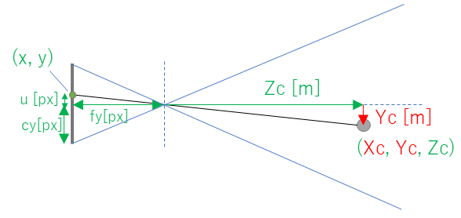

# OpenCVとDepth Mapを用いて、3次元再構築する

# この記事について
- 1枚の静止画像とdepth mapから3次元の点群を生成します。そして、再現された3D空間を自由に動き回ってみます
- ピンホールカメラモデルについて記した、下記の記事を理解している前提で記載します
    - https://github.com/iwatake2222/opencv_sample/tree/master/01_article/00_camera_model

[demo_video]

## 環境
### 環境 (Windows)
- Core i7-11700 @ 2.5GHz x 8 cores (16 processors)
- Windows 11 Home
- Visual Studio 2019
- cmake-gui
- OpenCV 4.5.4
    - https://github.com/opencv/opencv/releases/download/4.5.4/opencv-4.5.4-vc14_vc15.exe

### 環境 (Linux)
- Core i7-11700 @ 2.5GHz x 8 cores (16 processors)
- Ubuntu 20.04 (5.10.16.3-microsoft-standard-WSL2)
- apt install build-essential cmake libopencv-dev

## コードの場所
https://github.com/iwatake2222/opencv_sample/tree/master/01_article/01_3d_reconstruction

- 本処理はそこそこ重いです。特に、Visual StudioのDebugモードで動かすと非常に遅くなります
- 上記コードは分かりやすさ重視のために、最適化などは行っていません。また、歪も考慮していません
- そこらへんも対応したコードは下記をご参照ください 
    - https://github.com/iwatake2222/opencv_sample 

### プロジェクト構造
- 01_3d_reconstruction/
    - CMakeLists.txt
    - main.cpp
        - 描画処理や、キーボード・マウス入力をする
    - camera_model.h
        - ピンホールカメラモデル用のクラス。カメラパラメータを格納し、変換用の関数などを提供する
    - depth_engine.cpp, depth_engine.h
        - MiDaSを用いたdepth mapの推論処理を行う
    - resource/
        - 画像ファイルを格納する。テストしたい画像はここに保存しておく
    - resource/model/midasv2_small_256x256.onnx
        - 奥行き (depth) 推定用のモデル
        - ダウンロードしておく https://github.com/isl-org/MiDaS/releases/download/v2_1/model-small.onnx

```cmake:CMakeLists.txt
cmake_minimum_required(VERSION 3.0)

project(main)

set(CMAKE_C_STANDARD 11)
set(CMAKE_CXX_STANDARD 14)

find_package(OpenCV REQUIRED)
include_directories(${OpenCV_INCLUDE_DIRS})
link_libraries(${OpenCV_LIBS})

add_executable(main main.cpp camera_model.h depth_engine.cpp depth_engine.h)

file(COPY ${CMAKE_CURRENT_LIST_DIR}/../../resource DESTINATION ${CMAKE_BINARY_DIR}/)
add_definitions(-DRESOURCE_DIR="${CMAKE_BINARY_DIR}/resource/")
```

# 3次元再構築の方法
## 目的
- 入力: 静止画像1枚
- 画像座標系の点(x, y)[px] から、ワールド座標系の点(Xw, Yw, Zw)に変換する
- 変換した点群(Xw, Yw, Zw)の中を、自由に動き回る

## 方法
### 基本的な考え方
- 単純に、(x, y)の2変数から、(Xw, Yw, Zw)という3つの値を計算で出すことは不可能です
- そのため、ここでは奥行をディープラーニングモデルによって取得します。depth map、つまりZcを得ることができます
- Zcが分かれば、カメラ座標系での座標(Xc, Yc, Zc)は下記の通り簡単に計算可能です
    - $ u : fy = Yc : Zc $
    - ⇒ $ Yc = u * Zc / fy [px] = (y - cy) * Zc / fy [px] $
- Xcについても同様に以下のように計算できます
    - $ Xc = v * Zc / fx [px] = (x - cx) * Zc / fx [px] $



### 2D → 3D (3次元再構築)
- まず、入力となる静止画像を撮影したカメラを考えます(camera_2d_to_3d)
- このcamera_2d_to_3dを使って静止画像を撮影したと仮定します。そのため、可能であれば撮影に使ったカメラのカメラパラメータを取得してください
- 出来ない場合は、適当に以下のようにします
    - Width, Height: 静止画像のサイズ
    - cx = Width / 2
    - cy = Height / 2
    - fx = fy = 適当に。500 ～ 1500くらい  (c / tan(FoV / 2))
- また、考え方を簡単にするため、本プロジェクトではcamera_2d_to_3dはワールド座標の原点に設置したとします。つまり、(Xw, Yw, Zw) = (Xc, Yc, Zc)となります
- 先ほどは画像座標系からカメラ座標系への変換式を導出しましたが、これをワールド座標系にそのまま置き換えます (添え字のcをwに変えるだけ)
    - $ Xw = Xc = v \times Zc / fx  \text{  [px]}  = (x - cx) \times Zc / fx \text{  [px]} $
    - $ Yw = Yc = u \times Zc / fy  \text{  [px]}  = (y - cy) \times Zc / fy \text{  [px]} $
    - $ Zw = Zc = depthmapから取得できる値 $

### 3D → 2D (新しいカメラで再投影)
- 次に、再現した3D空間を自由に動きたいです。そのために、新しいカメラcamera_3d_to_2dを考えます
- このcamera_3d_to_2dは、結果を表示するためのカメラなので、自由に決められます。内部カメラパラメータも、camera_2d_to_3dと同じにする必要はありません。
    - 負荷や見え方などを考えて、適当に640x480程度に設定します
- 先ほど計算した点群(Xw, Yw, Zw)を、このカメラcamera_3d_to_2dで撮影したとして、描画します
- また、自由に動くために、camera_3d_to_2dの外部パラメータ(カメラ姿勢と位置)をマウス、キーボードに合わせて変化させます


# Depth推定について
- ということで、奥行きZcさえ分かれば、割と簡単に3次元再構築はできてしまいます
- depth推定が鍵となりますが、それについてはここでは細かく触れませんが、ざっと説明だけします

## 使用するモデル
- MiDaS v2.1 small
    - https://github.com/isl-org/MiDaS
    - https://github.com/isl-org/MiDaS/releases/download/v2_1/model-small.onnx
- 入力: 256x256のRGB画像
- 出力: 256x256のdepth map (float)
    - 値は、Inverse relative depth
        - 遠いと小さい値、近いと大きい値になる
        - 単位はなし
    - なぜ?
        - 遠い = 大きい値、とすると空を撮影した場合などに無限値になってしまうので、逆にしたほうが都合がよい
        - 絶対値を取ることはできないのでrelative。だけど、正解(絶対値)とは線形の相関関係になる

## 出力値の扱い方
- MiDaSの出力値は、Inverse relative depthとなり、そのままでは使いづらいため、以下のように正規化します
    - 0-255で正規化: $ 255 - 255 \times (value - min) / (max - min) $
    - scale_shift正規化: $ 1 / (value \times scale + shift) $
- depth mapそのものを描画出力するときは、0-255で正規化だといい感じに表示されます
- scale_shift正規化のためには、scaleとshiftの値が必要になります。2点以上の正解値(実測値)があれば、最小二乗法によって求めることができます
- 今回は、結果をいい感じに表示したいだけなので、実は絶対値は不要です。そのため、scaleとshiftの値は適当に設定します
- いずれにしろ、Zcの絶対値[m]を取得することはできません。今回は(Xw, Yw, Zw)が相対的に分かればOKとします
    - スケールがめちゃくちゃ小さい(Xw, Yw, Zw)を近くで見ても、スケールが大きい(Xw, Yw, Zw)を遠くから見ても、見え方は同じになるので気にしない

- 絶対値が取れないとはいえ、scale_shift正規化を使った方が良い結果になると思ったのですが、0-255で正規化で正規化した方がいい感じの結果になりました。なので、ここでは変換処理にも0-255で正規化を使います

## 推論方法
- MiDaSモデルを用いて推論処理をするために、OpenCVが提供するcv::dnnモジュールを使います
- これを使った実装処理は下記モジュールが提供します。中身の説明は省略します
    - depth_engine.cpp

# 3次元再構築をコードで実装する
## カメラモデルの実装
### 2D → 3Dへの変換処理
- 前回作成した、`CameraModel` というクラスに`ProjectImage2Camera` という関数を追加します
- これは、画像座標系での位置(x, y)と奥行きZcを入力として、カメラ座標系での位置(Xc, Yc, Zc)を出力します
- 入出力はvectorにしています。また、どうせ画像上のすべての点について処理するので、入力引数から(x, y)は削除しています

```cpp:camera_model.h
class CameraModel {
    略
    void ProjectImage2Camera(const std::vector<float>& z_list, std::vector<cv::Point3f>& object_point_list)
    {
        if (z_list.size() != this->width * this->height) {
            printf("[ProjectImage2Camera] Invalid z_list size\n");
            return;
        }

        /*** Generate the original image point list ***/
        /* todo: no need to generate every time */
        std::vector<cv::Point2f> image_point_list;
        for (int32_t y = 0; y < this->height; y++) {
            for (int32_t x = 0; x < this->width; x++) {
                image_point_list.push_back(cv::Point2f(float(x), float(y)));
            }
        }

        object_point_list.resize(image_point_list.size());

        for (int32_t i = 0; i < object_point_list.size(); i++) {
            const auto& image_point = image_point_list[i];
            const auto& Zc = z_list[i];
            auto& object_point = object_point_list[i];

            float x = image_point_list[i].x;
            float y = image_point_list[i].y;

            float u = x - this->cx();
            float v = y - this->cy();
            float Xc = Zc * u / this->fx();
            float Yc = Zc * v / this->fy();
            object_point.x = Xc;
            object_point.y = Yc;
            object_point.z = Zc;
        }
    }
};
```


## アプリケーションの実装
- 2つのカメラを用意しています
    - `InitializeCamera` 関数でパラメータを設定しています
    - `camera_2d_to_3d` : 入力となる静止画像を撮影したカメラです。このカメラの位置をワールド座標原点とします。3D再構築に使います
    - `camera_3d_to_2d` : 再構築した3Dの点を表示するために使います。キーボード、マウスでカメラ位置を自由に変えます
- `main` 関数の先頭
    - まずは静止画像を読み込み、処理しやすいサイズにリサイズします。そして、入力サイズに合わせてカメラパラメータの設定をしています
    - そのあと、depth mapを生成しています。正規化した結果は`depth_list` に格納されます
    - そして、先ほど作成した `ProjectImage2Camera` 関数を呼び、入力静止画像の各点(2D)を3D空間の点(Xw, Yw, Zw)に変換し、`object_point_list` として格納しておきます
- `main` 関数のwhileループ内
    - 結果表示用の`camera_3d_to_2d` を用いて、3Dの点を2D上に投影します
    - 投影する際に、単に結果を描画していくと、以下のような問題が発生します
        - 2つの異なる3D点が、2D画像上で同じ位置に投影される可能性があります。そのとき、描画する順番によってはカメラより奥にある点が、手前にある点を上書きしてしまうことがあります
        - 回避するために、描画時にその点のZcをチェックして、既に描画済みのZcよりも奥だったら描画しない、とする方法があります。Zバッファ法 (Depth Buffer法)
        - ここでは、一度全部の点のZcを計算し、Zcの小さい順に描画をすることで、この問題を回避しています。`indices_depth` に奥にある方から順に(Zcの大きい順に)、インデックス番号が格納されます
- `camera_3d_to_2d` カメラの外部パラメータをマウス、キーボード操作によって変えることで、自由に動くことができます。実装の中身は前回と同様であるため、下記には省略しています

```cpp:main.cpp
/*** Macro ***/
static constexpr char kInputImageFilename[] = RESOURCE_DIR"/room_02.jpg";
static constexpr float   kCamera2d3dFovDeg = 80.0f;
static constexpr int32_t kCamera3d2dWidth = 640;
static constexpr int32_t kCamera3d2dHeight = 480;
static constexpr float   kCamera3d2dFovDeg = 80.0f;
#define NORMALIZE_BY_255

/*** Global variable ***/
static CameraModel camera_2d_to_3d;
static CameraModel camera_3d_to_2d;

/*** Function ***/
void InitializeCamera(int32_t width, int32_t height)
{
    camera_2d_to_3d.SetIntrinsic(width, height, FocalLength(width, kCamera2d3dFovDeg));
    camera_2d_to_3d.SetExtrinsic(
        { 0.0f, 0.0f, 0.0f },    /* rvec [deg] */
        { 0.0f, 0.0f, 0.0f }, true);   /* tvec (Oc - Ow in world coordinate. X+= Right, Y+ = down, Z+ = far) */
                                       /* tvec must be zero, so that calculated Mc(Location in camera cooridinate) becomes the same as Mw(location in world coordinate), and can be used to convert from 3D to 2D later */

    camera_3d_to_2d.SetIntrinsic(kCamera3d2dWidth, kCamera3d2dHeight, FocalLength(kCamera3d2dWidth, kCamera3d2dFovDeg));
    camera_3d_to_2d.SetExtrinsic(
        { 0.0f, 0.0f, 0.0f },    /* rvec [deg] */
        { 0.0f, 0.0f, 0.0f }, true);   /* tvec (Oc - Ow in world coordinate. X+= Right, Y+ = down, Z+ = far) */

}

int main(int argc, char* argv[])
{
    /* Read image */
    cv::Mat image_input = cv::imread(kInputImageFilename);
    if (image_input.empty()) return -1;
    cv::resize(image_input, image_input, cv::Size(), 0.5, 0.5);

    InitializeCamera(image_input.cols, image_input.rows);

    /* Estimate depth */
    DepthEngine depth_engine;
    depth_engine.Initialize("");
    cv::Mat mat_depth;
    depth_engine.Process(image_input, mat_depth);

    /* Draw depth */
    cv::Mat mat_depth_normlized255;
    depth_engine.NormalizeMinMax(mat_depth, mat_depth_normlized255);
    cv::Mat image_depth;
    cv::applyColorMap(mat_depth_normlized255, image_depth, cv::COLORMAP_JET);
    cv::resize(image_depth, image_depth, image_input.size());

    /* Normalize depth for 3D reconstruction */
    cv::Mat mat_depth_normlized;
#ifdef NORMALIZE_BY_255
    mat_depth_normlized255.convertTo(mat_depth_normlized, CV_32FC1);
#else
    depth_engine.NormalizeScaleShift(mat_depth, mat_depth_normlized, 1.0f, 0.0f);
#endif
    cv::resize(mat_depth_normlized, mat_depth_normlized, image_input.size());

    /* Generate depth list */
    std::vector<float> depth_list;
    for (int32_t y = 0; y < mat_depth_normlized.rows; y++) {
        for (int32_t x = 0; x < mat_depth_normlized.cols; x++) {
            float Z = mat_depth_normlized.at<float>(cv::Point(x, y));
            depth_list.push_back(Z);
        }
    }

    /* Convert px,py,depth(Zc) -> Xc,Yc,Zc(in camera_2d_to_3d)(=Xw,Yw,Zw) */
    std::vector<cv::Point3f> object_point_list;
    camera_2d_to_3d.ProjectImage2Camera(depth_list, object_point_list);

    while (true) {
        /* Project 3D to 2D(new image) */
        std::vector<cv::Point2f> image_point_list;
        camera_3d_to_2d.ProjectWorld2Image(object_point_list, image_point_list);

        /* Generate object points in camera coordinate to draw the object in Zc order, from far to near (instead of using Z buffer) */
        std::vector<cv::Point3f> object_point_in_camera_list;
        camera_3d_to_2d.ProjectWorld2Camera(object_point_list, object_point_in_camera_list);

        /* Argsort by depth (index_0 = Far, index_len-1 = Near)*/
        std::vector<int32_t> indices_depth(object_point_in_camera_list.size());
        std::iota(indices_depth.begin(), indices_depth.end(), 0);
        std::sort(indices_depth.begin(), indices_depth.end(), [&object_point_in_camera_list](int32_t i1, int32_t i2) {
            return object_point_in_camera_list[i1].z > object_point_in_camera_list[i2].z;
            });

        /* Draw the result */
        cv::Mat mat_output = cv::Mat(camera_3d_to_2d.height, camera_3d_to_2d.width, CV_8UC3, cv::Scalar(0, 0, 0));
        for (int32_t i : indices_depth) {
            if (CheckIfPointInArea(image_point_list[i], mat_output.size())) {
                cv::circle(mat_output, image_point_list[i], 4, image_input.at<cv::Vec3b>(i), -1);
            }
        }

        cv::imshow("Input", image_input);
        cv::imshow("Depth", image_depth);
        cv::imshow("Reconstruction", mat_output);

        int32_t key = cv::waitKey(1);
        if (key == 27) break;   /* ESC to quit */
        TreatKeyInputMain(key);
        cv::setMouseCallback("Reconstruction", CallbackMouseMain);
    }

    depth_engine.Finalize();
    cv::waitKey(-1);

    return 0;
}
```

# おわりに
コンピュータビジョン楽しいよ