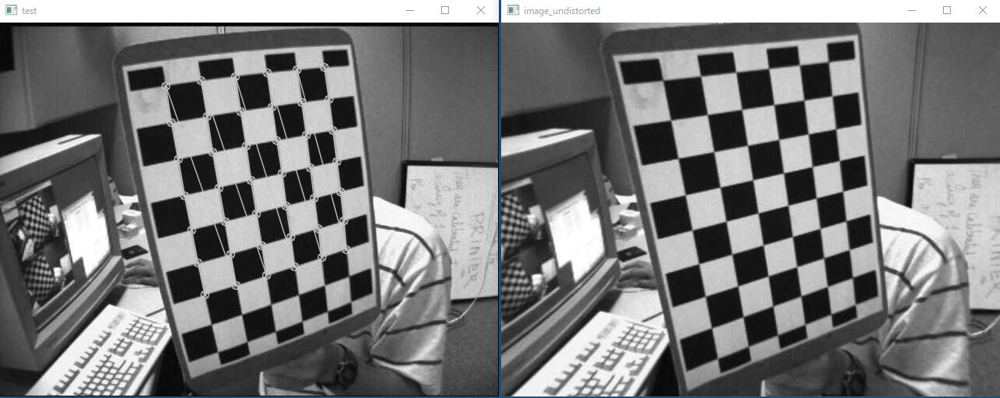
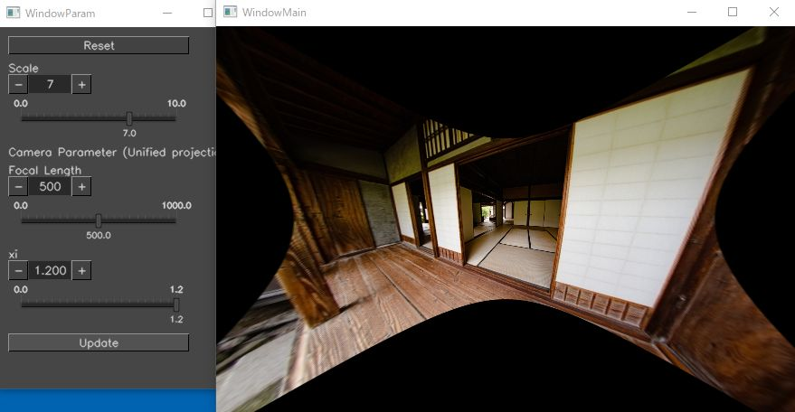
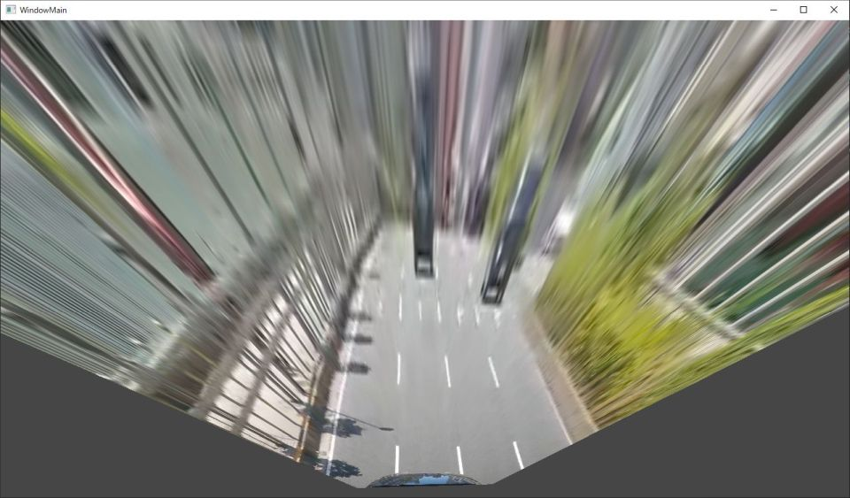
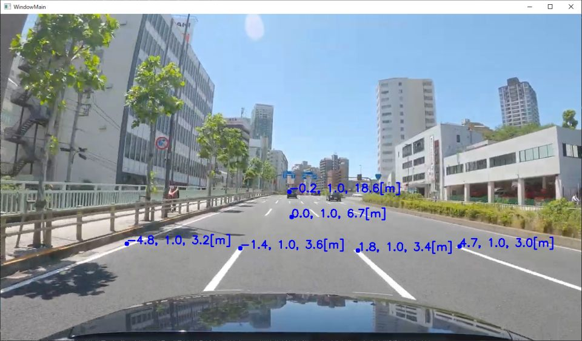
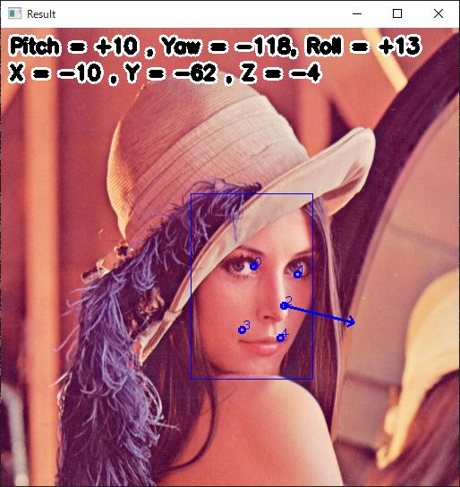

# OpenCV Sample Code
https://user-images.githubusercontent.com/11009876/131844621-a7c43048-edd7-4f74-b85d-7c7bf74f53bb.mp4

## undistortion_calibration

- Basic camera calibration using chessboard pattern

## undistortion_manual_unified_projection

- Manual camera calibration using the unified projection model for fisheye / omnidirectional camera

## projection_points_3d_to_2d
- Projection (3D points (world coordinate) to a 2D image plane) using editable camera parameters

https://user-images.githubusercontent.com/11009876/131841810-3901988e-223f-4ec8-967d-372c6a53de04.mp4

https://user-images.githubusercontent.com/11009876/131841829-4c38c713-fa71-4997-a9df-ca5e35ce348d.mp4

## projection_image_3d_to_2d
- Projection (image in world coordinate to a 2D image plane) using editable camera parameters

https://user-images.githubusercontent.com/11009876/131841863-bee26051-f8c0-4dd2-a31c-a4b8f1df722b.mp4

## transformation_topview_projection
- Transformation to top view image using projection

## transformation_homography
- Homobraphy transformation

https://user-images.githubusercontent.com/11009876/132087422-79d37de1-3ea4-476c-88c1-eb53cf88b492.mp4

## distance_calculation
- Distance calculation on ground plane

## dnn_face
- Face Detection using YuNet
- Head Pose Estimatino Using SolvePnP
- Overlay icon with transparent mask

## dnn_depth_midas
- Depth estimation using MiDaS small V2.1
- You need to download the model
    - from: https://github.com/isl-org/MiDaS/releases/download/v2_1/model-small.onnx
    - to: `resource/mdoel/midasv2_small_256x256.onnx`

## reconstruction_depth_to_3d
- 3D Reconstruction
    - Generate 3D point cloud from one single still image using depth map
    - Project these points onto 2D image with a virtual camera

# License
- Copyright 2021 iwatake2222
- Licensed under the Apache License, Version 2.0
    - [LICENSE](LICENSE)

# Acknowledgements
- cvui
    - https://github.com/Dovyski/cvui
    - Copyright (c) 2016 Fernando Bevilacqua
    - Licensed under the MIT License (MIT)
    - Source code is copied
- OpenCV
    - https://github.com/opencv/opencv
    - Licensed under the Apache License, Version 2.0
    - Image files are copied
- OpenCV Zoo
    - https://github.com/opencv/opencv_zoo
    - Licensed under the Apache License, Version 2.0
    - Model files are copied
- MiDaS
    - https://github.com/isl-org/MiDaS
    - Copyright (c) 2019 Intel ISL (Intel Intelligent Systems Lab)
    - Licensed under the MIT License
- https://pixabay.com/ja/
    - room_00.jpg, room_01.jpg, room_02.jpg
- https://www.photo-ac.com
    - fisheye_00.jpg
- YouTube
    - dashcam_00.jpg (Copyright Dashcam Roadshow 2020. https://www.youtube.com/watch?v=tTuUjnISt9s )
- Others
    - https://lovelive-as.bushimo.jp/wp-content/uploads/2019/09/chara_09_stage.png (https://lovelive-as.bushimo.jp/member/rina/ )
